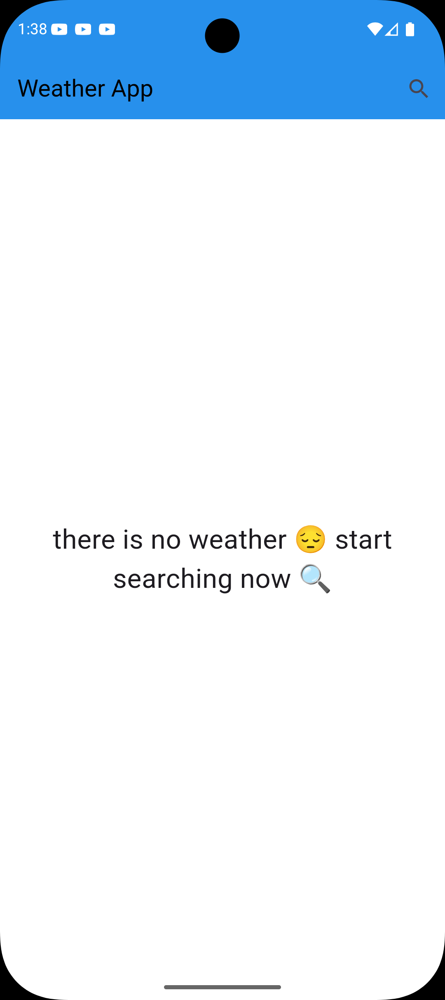
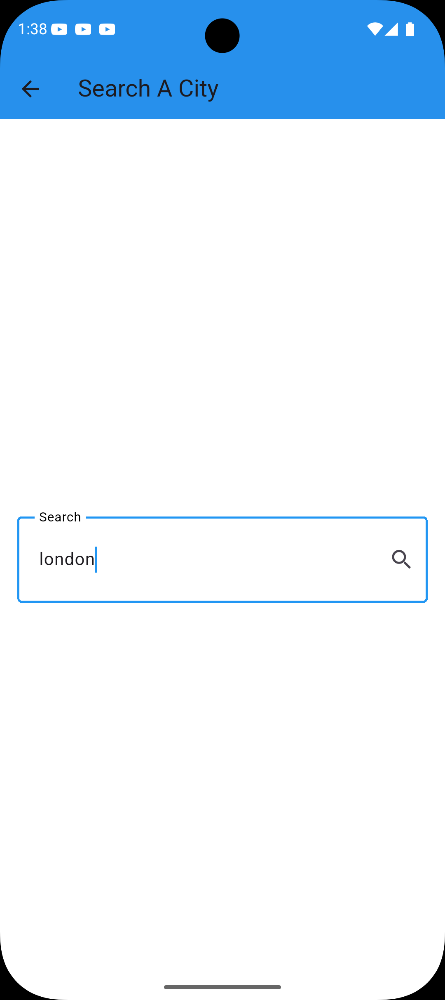
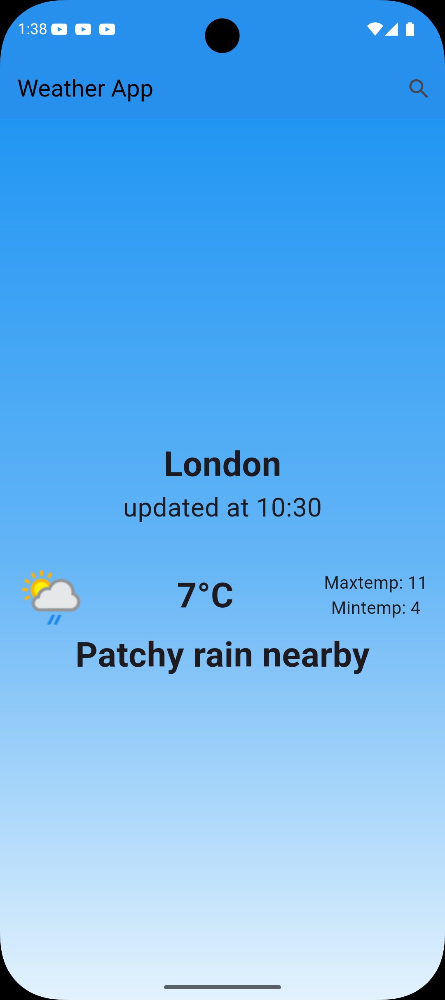
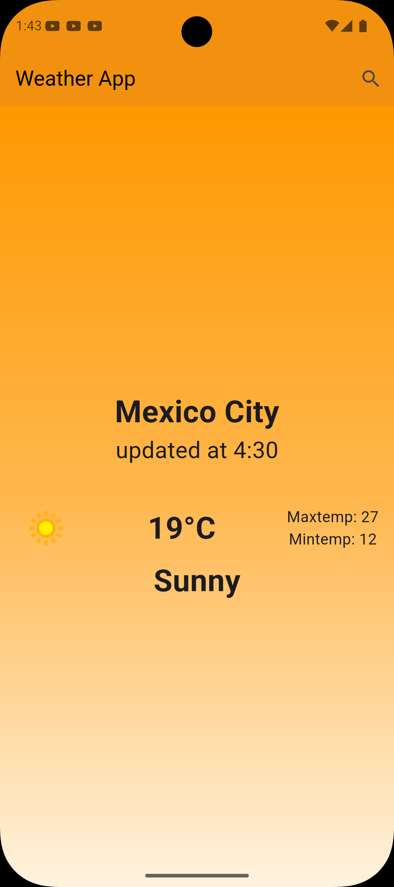
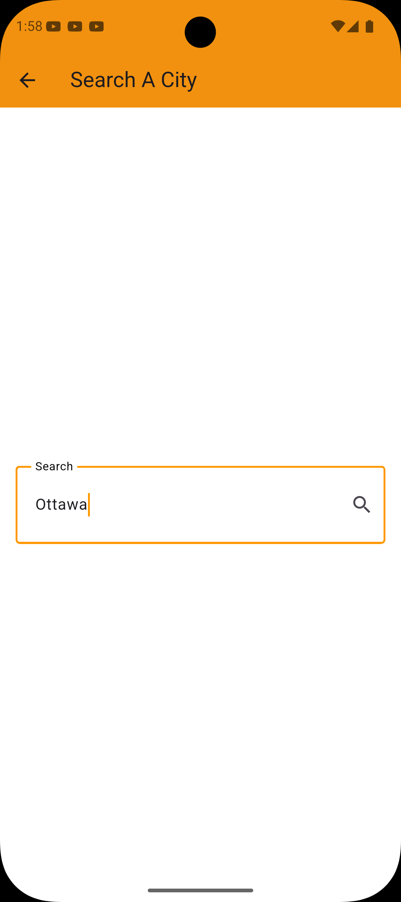
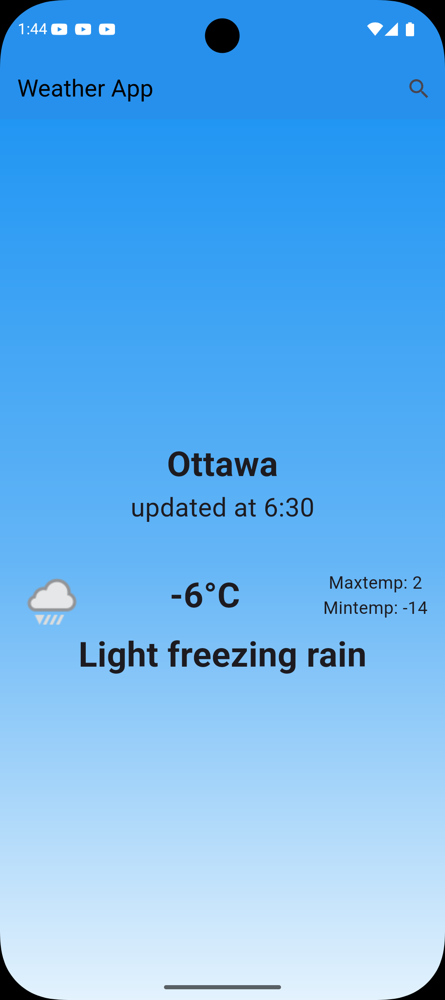

# Weather App

A Flutter application for displaying weather conditions and forecasts in an interactive and attractive way.

## 🌟 Features

- Display current weather conditions for any city worldwide
- Attractive and interactive user interface
- Support for multiple weather conditions (Clear, Cloudy, Rainy, Snowy, Thunderstorm)
- Automatic theme color changes based on weather conditions
- Easy search functionality to find any city
- BLoC pattern for state management
- Illustrative images for each weather condition

## 🛠️ Technologies Used

- **Flutter** - Main framework
- **Dart** - Programming language
- **flutter_bloc** - State Management (BLoC pattern)
- **Dio** - HTTP client for fetching weather data
- **cached_network_image** - Image caching

## 📦 Installation & Running

### Prerequisites

- Flutter SDK (version 3.5.4 or later)
- Dart SDK
- Android Studio / VS Code
- Emulator or physical device for testing

### Installation Steps

1. Clone the project:
```bash
git clone <repository-url>
cd weather_app
```

2. Install dependencies:
```bash
flutter pub get
```

3. Run the app:
```bash
flutter run
```

## 🏗️ Project Structure

```
lib/
├── cubits/              # BLoC for state management
│   └── git_weather_cubit/
│       ├── get_weather_cubit.dart
│       └── get_weather_states.dart
├── models/              # Data models
│   └── weather_model.dart
├── services/            # Services and network calls
├── views/               # Screens and views
│   ├── home_view.dart
│   ├── search_view.dart
│   └── helpers/
├── widget/              # Custom UI widgets
└── main.dart            # Application entry point
```

## 🎨 Detailed Features

### State Management with BLoC
The app uses the BLoC pattern to separate business logic from UI, making the code more organized and maintainable.

### Supported Weather Conditions
- ☀️ Clear
- ☁️ Cloudy
- 🌧️ Rainy
- ❄️ Snow
- ⛈️ Thunderstorm

### Theme Customization
The app's theme color automatically changes based on the current weather condition using `WeatherModel.getThemeColor()`.

## 📸 Screenshots

<div align="center">
  
  
  
</div>

<div align="center">
  
  
  
  
</div>

<p align="center">
  <em>App interface showcasing different weather conditions and features</em>
</p>

## 🚀 Building for Production

### Android
```bash
flutter build apk --release
```

### iOS
```bash
flutter build ios --release
```

### Web
```bash
flutter build web --release
```

### Windows
```bash
flutter build windows --release
```

### Linux
```bash
flutter build linux --release
```

### macOS
```bash
flutter build macos --release
```

## 📱 Supported Platforms

- ✅ Android
- ✅ iOS
- ✅ Web
- ✅ Windows
- ✅ Linux
- ✅ macOS

## 🔮 Future Enhancements

- [ ] Add multi-day weather forecasts
- [ ] Multi-language support
- [ ] Weather notifications
- [ ] Current user location detection
- [ ] Interactive maps

## 📝 License

This project is open-source and available for personal and educational use.

## 🤝 Contributing

Contributions are welcome! Please open an Issue or submit a Pull Request for any improvements or fixes.

## 📬 Contact

For questions or inquiries, please open an issue in the repository.

---

**Note:** This project is for educational purposes and is a great starting point for Flutter beginners.

## 📚 Useful Resources

- [Flutter Documentation](https://docs.flutter.dev/)
- [Lab: Write your first Flutter app](https://docs.flutter.dev/get-started/codelab)
- [Cookbook: Useful Flutter samples](https://docs.flutter.dev/cookbook)
- [flutter_bloc](https://bloclibrary.dev/)
- [Dio](https://pub.dev/packages/dio)
